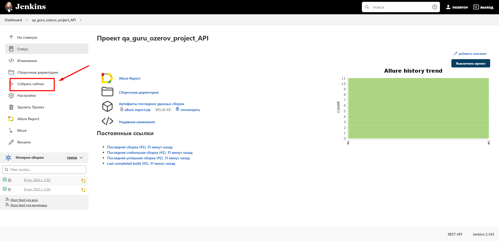
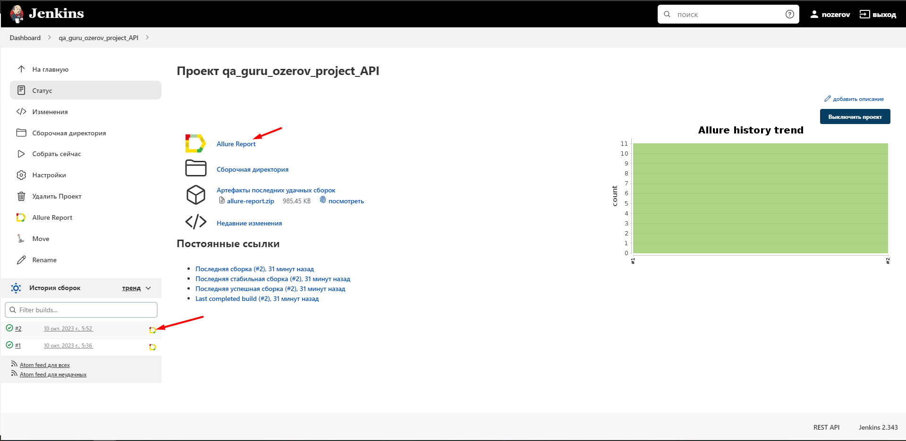
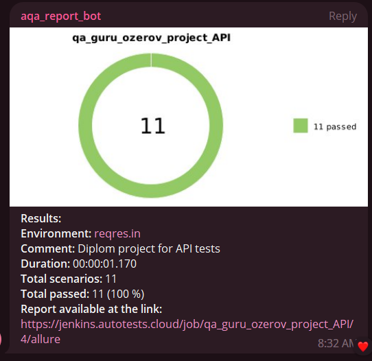

# Пример проекта API автотестов на демо-сайте  "reqres"
> https://reqres.in/ - образец приложения, которое используется для практики REST-запросов.

### Используемые технологии
<p  align="center">
  <code></code>
  <code></code>
  <code></code>
  <code></code>
  <code></code>
  <code></code>
</p>

## Покрываемый функционал
### Ресурс reqres
- Создание пользователя
- Обновление данных пользователя
- Успешная регистрация нового пользователя
- Успешная авторизация
- Авторизация под невалидными данными
- Валидация схемы users
- Получение информации о странице с пользователями
- Получение информации об одном пользователе
- Получение информации о пользователе, которого нет в системе
- Удаление данных о пользователе из системы
- Регистрация под невалидными данными

## Запуск тестов


### Для локального запуска
1. Склонировать репозиторий ($ git clone [Git repo](https://github.com/Obrams/qa_guru_project_API))
2. Откройте проект в PyCharm
3. Введите в терминале команду
``` 
python -m venv .venv
source .venv/bin/activate
pip install -r requirements.txt
pytest .
```

### Запуск тестов в [Jenkins](https://jenkins.autotests.cloud/job/qa_guru_ozerov_project_API/)
Нажмите кнопку «Собрать сейчас»
<p></p>

###  Отчетность о прохождении тестов в Allure
#### Если тест запускался локально:
Введите в терминале команду 
```
allure serve allure-results
``` 
#### Если тест запускался в Jenkins
Нажмите Allure Report или кликните по иконке отчёта в завершённой сборке
<p></p>

### Отображение тестов в отчете


### <p> Telegram</p>
<p>Настроена отправка отчета в <a href='https://t.me/aqa_report_bot'>Telegram</a></p>
